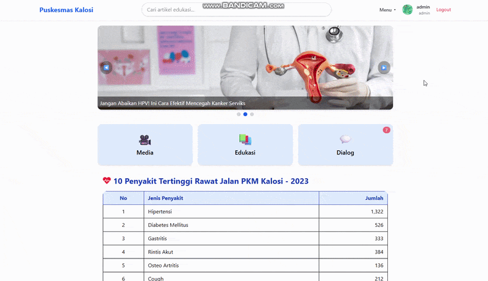
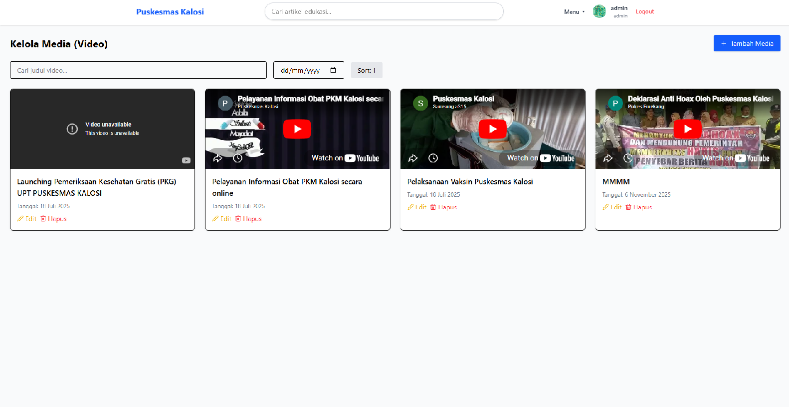
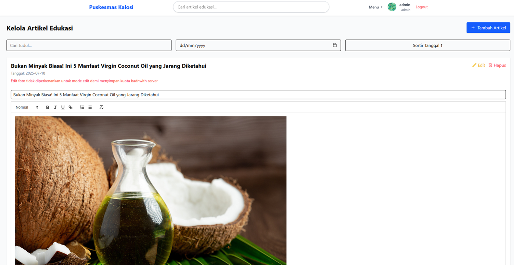
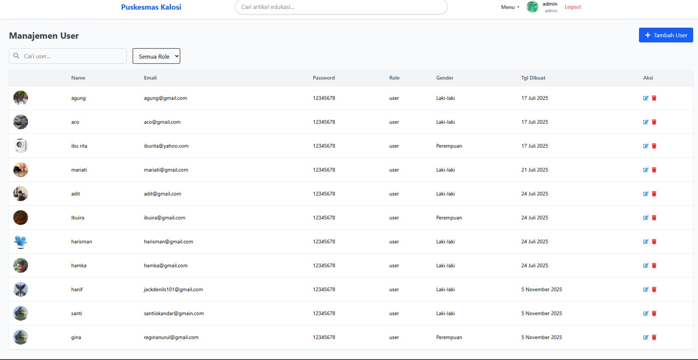

# Kalosi Health Center Information System (Web)

A web-based healthcare management system developed for the Kalosi Health Center. This application enables administrators and healthcare staff to manage health information, publish educational content, communicate with users in real time, and keep the community informed through a centralized dashboard.

The system is designed to streamline content management while providing a reliable communication platform between healthcare providers and the local community.

---

## ✨ Features

### 💬 Real-time Chat

Communicate with users through real-time messaging powered by Appwrite. Messages are synchronized instantly, allowing healthcare staff to respond efficiently.

### 👥 User Management

Manage registered users, monitor user information, and maintain account data through an intuitive administrative dashboard.

### 🎥 Education Video Management

Upload, organize, update, and remove educational health videos that are accessible from the mobile application.

### 📝 Article Management

Create, edit, and publish health articles using the **Quill Rich Text Editor**, allowing healthcare staff to write formatted content with images, headings, lists, and other rich-text features.

### 📰 Latest News Management

Publish and manage the latest announcements, public health information, and local healthcare news for the Kalosi community.

---

### 💬 Real-time Chat Demo



## 📸 Screenshots

| Dashboard                         | Article Management                  |
| --------------------------------- | ----------------------------------- |
|  |  |

| User Management                  |
| -------------------------------- |
|  |

---

## 🛠️ Tech Stack

### Frontend

- React
- Tailwind CSS
- React Router
- Quill Rich Text Editor

### Backend

- Appwrite
- Appwrite Authentication
- Appwrite Database
- Appwrite Realtime
- Appwrite Storage

---

## ⚡ Performance Optimizations

Several common React optimization techniques were implemented throughout the application to improve performance and maintainability.

- Code splitting with lazy-loaded pages
- Route-based lazy loading
- Component memoization using `React.memo`
- Memoized computations with `useMemo`
- Stable callback references with `useCallback`
- Optimized rendering by minimizing unnecessary component re-renders
- Reusable custom hooks for shared business logic
- Efficient state management for predictable updates
- Image optimization and lazy loading where appropriate
- Modular component architecture for better scalability

---

## 🚀 Getting Started

### Prerequisites

- Node.js
- npm or pnpm
- Appwrite Project

### Installation

```bash
git clone https://github.com/agungkrs21/web-kalosi-kesehatan.git

cd web-kalosi-kesehatan

npm install

npm run dev
```

Before running the project, configure your Appwrite endpoint, project ID, and API credentials.

---

## 📱 Related Project

A mobile version of this application is also available, providing the same healthcare services in a mobile-friendly experience.

**Mobile Application Repository**

https://github.com/agungkrs21/web-kalosi-kesehatan-mobile

---

## 🎯 Project Goals

- Provide an efficient administration platform for healthcare staff.
- Simplify the management of health-related content.
- Improve communication between healthcare providers and the community.
- Deliver trusted health education through articles and videos.
- Keep citizens informed with the latest local healthcare news.

---

## 👨‍💻 Author

**Agung Kurniawan**

Frontend Developer specializing in React, React Native, Next.js, and modern web technologies.
